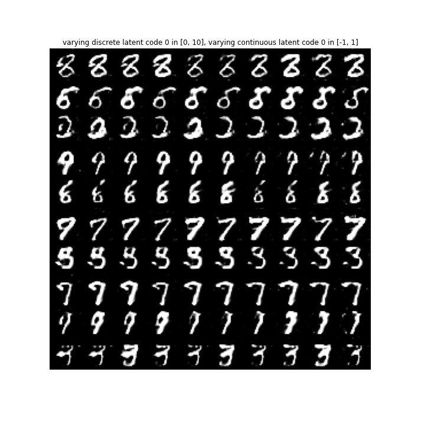
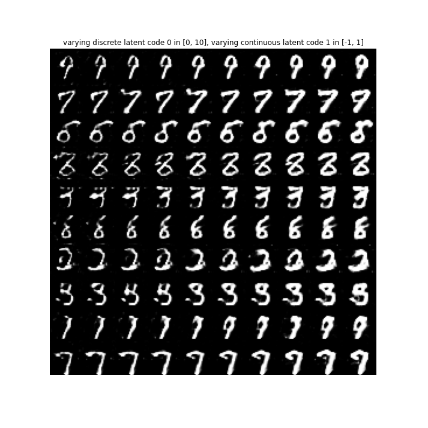

# InfoGAN

	This repository contains an implementation of InfoGAN on the MNIST dataset using TensorFlow 2.0.


[](https://colab.research.google.com/github/amir7d0/InfoGAN/blob/main/infogan.ipynb)

[](https://wandb.ai/amir7d0/infogan_mnist)


## Requirements
```sh
tensorflow==2.11.0
tensorflow-probability==0.19.0
numpy==1.23.4
matplotlib==3.6.2

# if you want to use tfds for celeb_a, svhn, etc datasets
# tensorflow-datasets
```

## Usage

1. Clone the repository: 
```sh
git clone https://github.com/amir7d0/InfoGAN.git
```
2. Edit the **`config.py`** file to set the training parameters and the dataset to use. Choose *`dataset`* from **['mnist', 'fashion_mnist']**
3. Run the training script:
```sh
python main.py
```

## Directory structure
```sh
.
├── infogan
│   ├── config.py
│   ├── datasets.py
│   ├── distributions.py
│   ├── infogan_model_openai.py
│   ├── infogan_model.py
│   ├── models.py
│   └── utils.py
├── main.py
├── README.md
└── results
    └── mnist_results


```
## Files

* `config.py`: Contains all the configuration parameters for training the model.
* `datasets.py`: Contains code for loading and preprocessing the dataset.
* `distributions.py`: Contains the code for the distributions.
* `utils.py`: Contains the code for Callbacks, sample, and plot functions.
* `models.py`: Contains the code for the generator, discriminator, and recognition networks.
* `infogan_model.py`: Contains the code for the InfoGAN class and train_step function.
* `infogan_model_openai.py`: Contains the code for the InfoGAN class and train_step function.
* `train.py`: Contains the code for training the model.

In `infogan_model.py` Continuous Latent code is optimized by minimizing Gaussian negative log likelihood loss (GaussianNLLLoss) which is H(c | G(z,c)) in Eq (4) in InfoGAN paper.

In `infogan_model_openai.py` Continuous Latent code is optimized by minimizing Gaussian negative log likelihood loss (GaussianNLLLoss) and negative Log Prob which is H(c) + H(c | G(z,c)) in Eq (4) in InfoGAN paper.

## Results
### MNIST

#### Settings

* Latent Variables (Dim=74)
	1. Random latent ~ Uniform(-1,1), dim = 62
	1. Discrete Latent Code ~ Categorical(k=10, p=0.1), dim = 10
    2. Continuous Latent Code ~ Uniform(-1,1), dim = 2
* Optimizer
	+ generator optimizer = Adam, lr=1e-3, beta1 = 0.5
	+ discriminator optimizer = Adam, lr=2e-4, beta1 = 0.5
* Lambda for latent codes: $\lambda_{disc} = 1.0, \lambda_{cont} = 1.0$
* Batch size = 128

#### Generated Images
Row represents categorical latent code from 0 to 9 and column represents continuous latent code varying from -1 to 1 (left to right).

<table align='center'>
<tr align='center'>
<th> first continuous variable varying from -1 to 1 </th>
<th> second continuous variable varying from -1 to 1 </th>
</tr>
<tr>
<td>
<td>
</tr>
</table>


#### Loss


## References

1. **X. Chen, Y. Duan, R. Houthooft, J. Schulman, I. Sutskever, P. Abbeel.** *"Infogan: Interpretable representation learning by information maximizing generative adversarial nets."* [[arxiv](https://arxiv.org/abs/1606.03657)]
2. **openai/InfoGAN** [[repo](https://github.com/openai/InfoGAN)]
3. **lisc55/InfoGAN** [[repo](https://github.com/lisc55/InfoGAN)]


